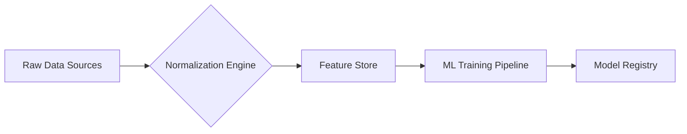

## Next-Generation AI-Powered Predictive Threat Intelligence Plan

### 1. Introduction
Predictive threat intelligence represents a paradigm shift from reactive to proactive cybersecurity. By leveraging artificial intelligence and machine learning, organizations can anticipate emerging threats, identify potential attack vectors before exploitation, and prioritize defensive measures more effectively. This plan outlines a comprehensive approach to building a next-generation predictive threat intelligence system.

### 2. Core Components

#### 2.1 Data Ingestion and Fusion
- **Sources**: Combine structured data (threat feeds, vulnerability databases) with unstructured data (dark web forums, social media, technical blogs)
- **Real-time Collection**: API integrations with threat intelligence platforms, social media monitoring tools
-- **Data Normalization**: Standardize formats using STIX/TAXII protocols

#### 2.2 Machine Learning Framework
- **Feature Engineering**: Extract indicators of compromise (IOCs), TTPs, threat actor behaviors
- **Algorithm Selection**: Ensemble methods combining:
  - Time-series forecasting (Prophet, ARIMA) for trend prediction
  - Graph neural networks for relationship mapping
  - Clustering algorithms (k-means, DBSCAN) for threat grouping
  - Anomaly detection for zero-day identification

#### 2.3 AI-Powered Analysis
- **Natural Language Processing**: Analyze threat reports and dark web communications
- **Generative AI Applications**: Simulate attacker behavior, generate defensive scenarios
- **Predictive Modeling**: Forecast attack probability using ensemble methods

### 3. Technical Architecture

#### 3.1 Data Pipeline

#### 3.2 Model Deployment
- **Continuous Training**: Automated retraining with new threat data
- **A/B Testing**: Compare model performance in production environments
- **Explainability Framework**: SHAP values, LIME for model interpretability

### 4. Implementation Roadmap

#### Phase 1: Foundation (0-3 Months)
- Data infrastructure setup and pipeline development
- Initial model training with historical threat data
- Baseline performance metrics established

#### Phase 2: Enhancement (3-6 Months)
- Integration of generative AI for scenario simulation
- Development of custom ensemble models
- Begin real-time monitoring and prediction

#### Phase 3: Optimization (6-12 Months)
- Continuous learning system implementation
- Integration with defensive tools (SIEM, EDR, firewall systems)
- Red team validation and performance tuning

### 5. Key Performance Indicators
- **Predictive Accuracy**: Precision/recall metrics for threat forecasting
- **Early Warning Time**: Average lead time before threats materialize
- **False Positive Rate**: Maintain below 5% threshold
- **Threat Coverage**: Percentage of emerging threats identified

### 6. Ethical Considerations
- Anonymization protocols for PII in threat data
- Regular bias audits of ML models
- Compliance with global data protection regulations

### 7. Maintenance and Evolution
- Quarterly threat landscape reassessment
- Model performance monitoring with automated drift detection
- Regular integration of new data sources and intelligence feeds

## Conclusion
This comprehensive approach combines cutting-edge AI/ML techniques with robust cybersecurity practices to create a predictive threat intelligence system capable of anticipating and mitigating emerging cyber threats before they materialize into actual attacks.
