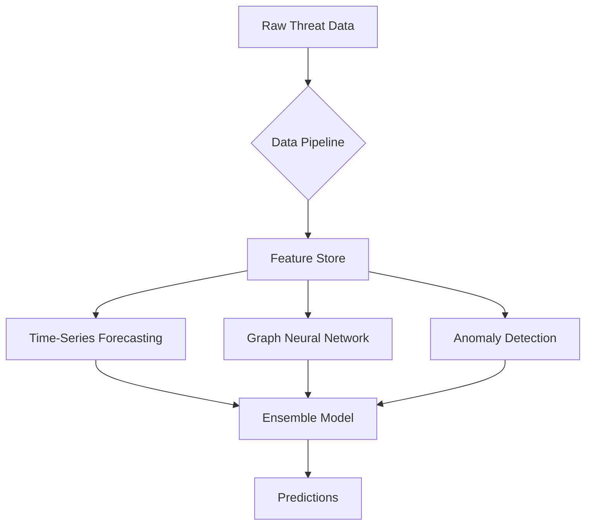

## AI-Powered Predictive Threat Intelligence System Architecture

### Visual Description

#### Data Ingestion Layer
- **Structured Data Sources**: Threat intelligence feeds (STIX/TAXII), vulnerability databases (CVE, NVD), industry sharing platforms
- **Unstructured Data Sources**: Dark web forums, social media platforms, technical blogs, research papers
- **Real-time Collection**: API integrations with threat platforms and custom web scraping

#### Data Processing Engine
- **Normalization Module**: Converts all incoming data to standardized formats
- **Feature Extraction**: Identifies key indicators (IOCs, TTPs, threat actors)
- **Contextual Enrichment**: Adds additional context from historical threat databases

#### Machine Learning Core

#### Analytics and Output Layer
- **Predictive Dashboard**: Visual interface showing threat forecasts and confidence levels
- **API Integration**: RESTful endpoints for SIEM, EDR, and firewall systems
- **Reporting Module**: Automated threat briefings and executive summaries
- **Alerting System**: Configurable thresholds for threat notifications

#### Continuous Learning Component
- **Feedback Loop**: Incorporates results from defensive actions and threat outcomes
- **Model Retraining**: Scheduled and event-triggered model updates
- **Performance Monitoring**: Tracks precision, recall, and false positive rates

### Key Technical Specifications
- **Data Throughput**: 1M+ events processed per hour
- **Model Inference Time**: <100ms for real-time predictions
- **Scalability**: Kubernetes-based deployment for horizontal scaling
- **Security**: Zero-trust architecture with hardware security modules

### Integration Points
1. **SIEM Systems**: Splunk, QRadar, Elastic SIEM
2. **EDR Solutions**: CrowdStrike, Microsoft Defender
3. **Firewall Platforms**: Palo Alto, Cisco, Fortinet
4. **Cloud Security**: AWS GuardDuty, Azure Security Center

## Operational Workflow
1. Data collection from diverse sources in real-time
2. Automated normalization and feature extraction
3. Parallel model execution with ensemble weighting
4. Threat scoring and prioritization
5. Actionable insights delivered to security teams
6. Continuous model refinement based on outcomes

This architecture provides a comprehensive, scalable approach to predictive threat intelligence that evolves with the threat landscape.